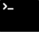

Merhaba, Hello, Hallo, and `print('merhaba')` 👋

- 🤖 I’m currently having a career break and learning _machine learning_.  
- 🎨 You can see my personal works [in my personal website](https://ikocabiyik.com/).  

Connect with me on: 
<a href="https://www.linkedin.com/in/imrankocabiyik/" target="_blank"><i class="fab fa-twitter"></i></a>
<a href="https://www.linkedin.com/in/imrankocabiyik/" target="_blank"><i class="fab fa-linkedin"></i></a>
<a href="https://stackoverflow.com/users/5070121/imran-kocabiyik" target="_blank"><i class="fab fa-stack-overflow"></i></a>

## Tools and Technologies I Use (and I like):  

## My Latest Blog Posts:

- [Mimicking an Art Technique with GANs](https://ikocabiyik.com/blog/en/replicating-loomis-method-with-gan-models/)
- [GANs with the Language of Game Theory](https://ikocabiyik.com/blog/en/gan-review/)
- [Review: TensorFow Certificate Program](https://ikocabiyik.com/blog/en/tensorflow-certificate-program/)